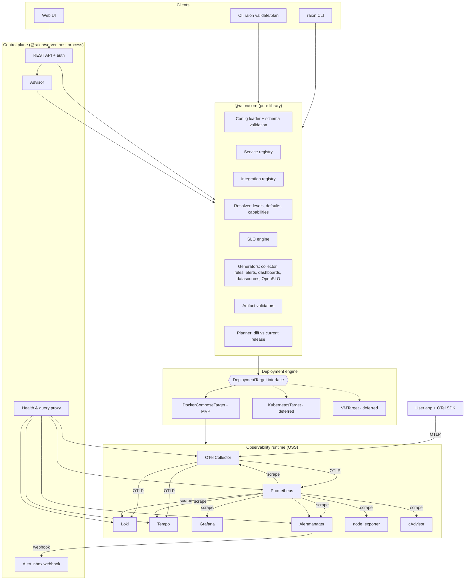
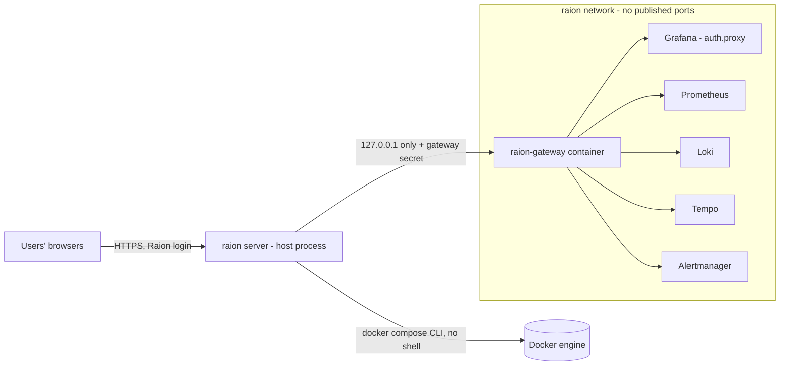
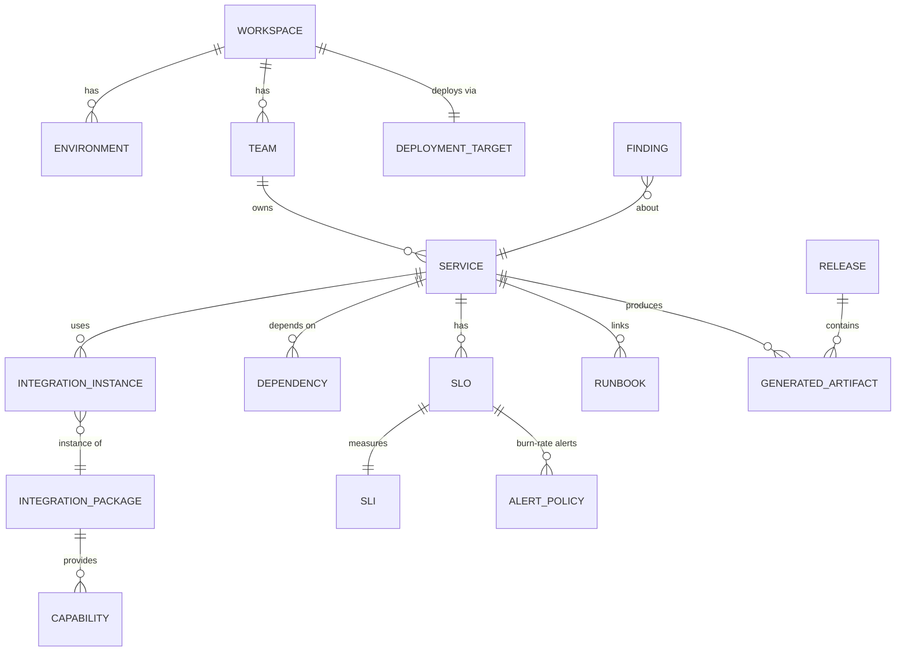

# Phase 0: Product and Architecture Design

Status: **Draft for review**. Nothing in Phase 1 begins until this design is accepted.
Working names: the platform is "the platform" and the CLI is `raion`. The final project name is still open (see §15).

---

## 1. Requirements analysis

### 1.1 What we are building

An **orchestration, configuration, and experience layer** over proven OSS observability components. It does three things:

1. **Model** a team's software as _Services_ with ownership, environment, dependencies, and reliability goals.
2. **Generate** standard, inspectable configuration for OpenTelemetry, Prometheus, Loki, Tempo, Grafana, and Alertmanager from that model.
3. **Deploy and operate** that configuration through pluggable deployment targets, then **advise** on gaps.

The core loop is:

```
describe service  ->  validate  ->  plan (show diff)  ->  apply (deploy)  ->  observe  ->  advise  ->  (loop)
```

### 1.2 What we are explicitly NOT building

| Not building                                 | Use instead                                                                                                                                                                   |
| -------------------------------------------- | ----------------------------------------------------------------------------------------------------------------------------------------------------------------------------- |
| A TSDB, log store, or trace store            | Prometheus (later Mimir), Loki, Tempo                                                                                                                                         |
| A query language                             | PromQL, LogQL, TraceQL, shown verbatim                                                                                                                                        |
| An agent or collector                        | OpenTelemetry Collector                                                                                                                                                       |
| A dashboarding engine                        | Grafana, with provisioned dashboards                                                                                                                                          |
| Alert routing, grouping, or silencing        | Alertmanager                                                                                                                                                                  |
| An SLO math engine nobody can verify         | Plain Prometheus recording and alerting rules, unit-tested with `promtool test rules`                                                                                         |
| A bespoke instrumentation SDK                | Upstream OpenTelemetry SDKs and zero-code instrumentation                                                                                                                     |
| A database for observability _configuration_ | Config files in Git plus an immutable release directory (§6.4). A small embedded SQLite store holds only _operational_ data: users, sessions, audit log, alert inbox (§11.2). |

The platform's outputs must keep working if the platform is uninstalled. Generated bundles are plain `compose.yaml`, `prometheus.yml`, rule files, dashboard JSON, and OpenSLO YAML.

### 1.3 Architectural boundaries (the decisions that shape everything)

1. **Config files are the source of truth.** The UI, API, and CLI all read and write the same YAML workspace. The UI is a guided editor for that YAML, not a separate state store. This gives GitOps, diffing, review, and no lock-in at no extra cost.
2. **One core library, many front-ends.** `raion` (CLI), the API server, and CI validation all call the same `@raion/core` functions. No logic lives only in the UI or only in the API.
3. **A pure generation pipeline.** `config -> resolved model -> artifacts` is deterministic and side-effect free, which makes it fully snapshot-testable. Side effects happen only in deployment adapters.
4. **Capabilities, not integrations, drive generation.** Integrations declare _capabilities_ such as `http.server`, `db.postgresql`, `host`, or `container`, along with the metric mappings that satisfy them. Dashboard, alert, and SLO generators consume capabilities. This lets an Nginx-fronted service get the same availability SLO template as a Node.js service.
5. **Backends behind interfaces.** `MetricsBackend` (Prometheus now, Mimir later), `LogsBackend`, and `TracesBackend` define ingest endpoints, query endpoints, and rule-loading mechanisms. Swapping Prometheus for Mimir changes an adapter, not the generators.
6. **Deployment targets behind interfaces.** Generators produce _target-agnostic artifacts_. A `DeploymentTarget` packages and deploys them as Compose mounts now, and as ConfigMaps or Helm values later.
7. **Integrations are data, not code.** An integration package is manifests plus templates. It cannot execute code or shell commands (§9). This is the main supply-chain control for community contributions.

### 1.4 MVP scope (Phases 1-7, Compose only)

- Deployment target: **Docker Compose** on a single Linux host (Docker Desktop on macOS or Windows also works, with documented limits in §7.5).
- Application integration: **Node.js** (OTel SDK, zero-code first).
- Infrastructure: Linux host (node_exporter), containers (cAdvisor, opt-in), and the stack's own health.
- Signals: metrics, logs, and traces, with log/trace correlation.
- Generated dashboards, alerts, availability and latency SLOs, multi-window multi-burn-rate alerts, and error budgets.
- Advisor with config-level auto-fixes.
- `raion init | validate | plan | apply | destroy | status | server | users`.
- A web UI covering onboarding, the service page, SLO creation, observability health, the advisor, and "show generated config".

---

## 2. Technology choices

| Area                          | Choice                                                                                                              | Why                                                                                                                                                            | Alternatives considered                                                                                                                                                                                                                                                                                                                                              |
| ----------------------------- | ------------------------------------------------------------------------------------------------------------------- | -------------------------------------------------------------------------------------------------------------------------------------------------------------- | -------------------------------------------------------------------------------------------------------------------------------------------------------------------------------------------------------------------------------------------------------------------------------------------------------------------------------------------------------------------- |
| Language (CLI, API, core, UI) | **TypeScript** (strict), Node.js ≥ 24 LTS                                                                           | One language across CLI, API, UI, and generators keeps the contributor barrier low. Strong YAML and JSON Schema tooling. Node 24 is already installed locally. | **Go** fits the Prometheus ecosystem natively (promql parser, single binary), but it is not installed here, it splits the codebase into two languages with the UI, and the Prometheus tooling we need is reachable via `promtool`, `amtool`, and `@prometheus-io/lezer-promql`. Revisit if a native single binary becomes essential. Node SEA can produce one later. |
| Monorepo                      | **pnpm workspaces** (via corepack), TypeScript project references                                                   | Simple and fast, with strict dependency isolation.                                                                                                             | Nx or Turborepo. Unnecessary for now and can be added later.                                                                                                                                                                                                                                                                                                         |
| Schemas                       | **zod v4**, exported to **JSON Schema**                                                                             | One source for runtime validation, TS types, and editor/CI schemas (YAML language server).                                                                     | Hand-written JSON Schema plus ajv. That duplicates the types.                                                                                                                                                                                                                                                                                                        |
| YAML                          | **`yaml`** (eemeli)                                                                                                 | Preserves comments and formatting when advisor auto-fixes patch user files, which matters for GitOps review.                                                   | `js-yaml`. It loses comments.                                                                                                                                                                                                                                                                                                                                        |
| API server                    | **Fastify** + pino + prom-client                                                                                    | Mature, schema-first, structured logs, and exposes its own `/metrics`.                                                                                         | Express. Weaker typing and validation.                                                                                                                                                                                                                                                                                                                               |
| UI                            | **React + Vite**, TanStack Query, Radix primitives, CSS variables                                                   | Accessible primitives, no heavy design system lock-in.                                                                                                         | Next.js. SSR is not needed for a local control plane.                                                                                                                                                                                                                                                                                                                |
| CLI                           | **commander**                                                                                                       | Small and well known.                                                                                                                                          | oclif. Heavier.                                                                                                                                                                                                                                                                                                                                                      |
| PromQL validation             | `@prometheus-io/lezer-promql` (in-process syntax) plus **`promtool`** (authoritative, run in a pinned container)    | Fast feedback plus real Prometheus semantics. `promtool test rules` unit-tests generated SLO alerts.                                                           | A custom parser. Rejected.                                                                                                                                                                                                                                                                                                                                           |
| Alertmanager validation       | **`amtool check-config`** (containerized)                                                                           | Authoritative.                                                                                                                                                 |                                                                                                                                                                                                                                                                                                                                                                      |
| Collector validation          | **`otelcol-contrib validate`** (containerized)                                                                      | Authoritative.                                                                                                                                                 |                                                                                                                                                                                                                                                                                                                                                                      |
| Dashboards                    | Typed builders. Evaluate `@grafana/grafana-foundation-sdk` in Phase 4 and fall back to our own typed JSON builders. | Generated, not hand-maintained. Grafana-version aware.                                                                                                         | Hand-written JSON per service. That is exactly what we are trying to avoid.                                                                                                                                                                                                                                                                                          |
| Tests                         | **vitest** (unit and golden), Playwright + axe (UI), real-container e2e in CI                                       |                                                                                                                                                                | Jest. Slower ESM story.                                                                                                                                                                                                                                                                                                                                              |
| Lint/format                   | ESLint (typescript-eslint, strict-type-checked), Prettier                                                           |                                                                                                                                                                | Biome. Viable, but less rule coverage today.                                                                                                                                                                                                                                                                                                                         |
| License                       | **Apache-2.0**                                                                                                      | Matches the OTel, Prometheus, and Grafana Agent ecosystem norm, and includes a patent grant.                                                                   | MIT, AGPL.                                                                                                                                                                                                                                                                                                                                                           |

### 2.1 Default OSS runtime stack (MVP)

| Component                             | Role                                                                             | Notes                                                                                                                                                                            |
| ------------------------------------- | -------------------------------------------------------------------------------- | -------------------------------------------------------------------------------------------------------------------------------------------------------------------------------- |
| **OpenTelemetry Collector (contrib)** | Single ingest point for OTLP. Processes, enriches, and routes all app telemetry. | Chosen over Alloy as the MVP default because it is the vendor-neutral upstream, uses portable YAML, and has `validate`. Alloy is a future alternative `CollectorBackend` (§8.3). |
| **Prometheus 3.x**                    | Metrics storage, rules, and scraping of infra exporters                          | Receives app metrics through its **native OTLP receiver** (`--web.enable-otlp-receiver`), which removes remote-write glue and mirrors how Mimir ingests OTLP.                    |
| **Loki 3.x**                          | Logs                                                                             | Native OTLP ingest. `trace_id`/`span_id` are kept as structured metadata.                                                                                                        |
| **Tempo**                             | Traces                                                                           | OTLP ingest.                                                                                                                                                                     |
| **Grafana**                           | Visualization                                                                    | Datasources and dashboards are provisioned from files with fixed UIDs.                                                                                                           |
| **Alertmanager**                      | Routing and notification                                                         | Default receiver: the platform's webhook inbox (§10.4), so alerts are visible without Slack or email.                                                                            |
| **node_exporter**                     | Host metrics                                                                     |                                                                                                                                                                                  |
| **cAdvisor**                          | Container metrics                                                                | **Opt-in**, because it needs elevated privileges (§11.4).                                                                                                                        |

Exact image versions are **not chosen in this document**. They are selected and verified in Phase 2, pinned **by digest** in a single `runtime/versions.yaml` manifest, and updated through Dependabot. This avoids design-time guesses about version numbers.

---

## 3. Logical architecture



### 3.1 How the required layers map to packages

| Required layer            | Package                                        | Responsibility                                                                | Side effects?                         |
| ------------------------- | ---------------------------------------------- | ----------------------------------------------------------------------------- | ------------------------------------- |
| 1. UI                     | `apps/web`                                     | Onboarding wizard, service pages, SLO builder, health, advisor, config viewer | None. Calls the API.                  |
| 2. API/control plane      | `apps/server`                                  | Auth, REST, query proxy, alert inbox, invoking core and deploy                | Yes                                   |
| 3. Configuration engine   | `packages/core/config`                         | Load, merge, and validate the workspace. Comment-preserving patches.          | Reads and writes workspace files only |
| 4. Service registry       | `packages/core/registry`                       | Resolved services, ownership, dependency graph                                | None                                  |
| 5. Integration registry   | `packages/integrations-sdk` + `integrations/*` | Discover, verify, and load integration packages. Capability index.            | Reads package dirs                    |
| 6. SLO engine             | `packages/core/slo`                            | SLI/SLO model, OpenSLO import/export, burn-rate rule generation               | None                                  |
| 7. Dashboard generator    | `packages/core/generators/dashboards`          | Capability-driven Grafana dashboards                                          | None                                  |
| 8. Alert/rule generator   | `packages/core/generators/rules`               | Recording rules, alert rules, Alertmanager config                             | None                                  |
| 9. Deployment engine      | `packages/deploy` + `packages/deploy-compose`  | Targets, releases, apply, rollback, status                                    | Yes                                   |
| 10. Observability runtime | `runtime/` (base configs, version manifest)    | The OSS components themselves                                                 | n/a                                   |

**Dependency rule (enforced by ESLint boundaries):** `core` depends on nothing in `apps/` or `deploy*`. `deploy` depends on `core` types only. `apps` depend on both. Generators never perform I/O.

### 3.2 Process model (MVP)

Raion is used by **multiple people**, so it has exactly **one entry point**: the Raion server.



- `raion server` runs the API and serves the UI as a **host process** (a systemd service on a team server, or run directly on a laptop). By default it binds `127.0.0.1`. To serve a team it binds a network address and **requires TLS** (`--tls-cert/--tls-key`) or an explicit `--trust-proxy` when it sits behind a TLS-terminating reverse proxy. It refuses to serve plain HTTP on a non-loopback address.
- The server does **not** run as a container with the Docker socket mounted, because socket access is root-equivalent. It invokes the host `docker compose` binary with fixed argument arrays (no shell).
- **No backend port is ever published.** A minimal reverse proxy container (`raion-gateway`, an unprivileged pinned nginx) is the only runtime component published, and only on `127.0.0.1`. Every request must carry a gateway secret held in `.raion/secrets`. Only the Raion server has that secret. Other users on the host, or anyone on the network, cannot query Prometheus, Loki, Tempo, or Alertmanager directly.
- **Grafana single sign-on.** Users open Grafana at `https://<raion>/grafana/`. Raion authenticates the user and forwards the request through the gateway with `X-WEBAUTH-USER` and a role header. Grafana's `auth.proxy` trusts those headers only from the gateway. Raion roles map to Grafana roles. Users have one login and one URL, with no shared Grafana admin password.
- The runtime runs as one Compose project, `raion`, on a dedicated network, `raion`.

---

## 4. Repository structure

```
/
├── apps/
│   ├── server/                 # Fastify control plane (raion server)
│   ├── cli/                    # raion entrypoint (thin; delegates to core/deploy)
│   └── web/                    # React UI
├── packages/
│   ├── schema/                 # zod schemas -> TS types + JSON Schema export
│   ├── core/
│   │   ├── config/             # loader, merger, patcher (comment-preserving)
│   │   ├── registry/           # services, teams, dependency graph
│   │   ├── resolve/            # levels, defaults, capability resolution
│   │   ├── slo/                # SLI/SLO model, OpenSLO, burn-rate math
│   │   ├── generators/         # collector | prometheus | rules | alertmanager | grafana | dashboards | openslo
│   │   ├── validate/           # artifact validators (in-process + tool-backed interface)
│   │   ├── plan/               # diff + impact classification
│   │   └── advisor/            # rules -> findings -> config patches
│   ├── integrations-sdk/       # manifest schema, loader, template interpolation, verification
│   ├── deploy/                 # DeploymentTarget interface, release store, rollback
│   ├── deploy-compose/         # DockerComposeTarget
│   ├── backends/               # MetricsBackend/LogsBackend/TracesBackend interfaces + prometheus/loki/tempo impls
│   └── testkit/                # fixtures, golden helpers, containerized promtool/amtool runners
├── packages/integrations/      # first-party integration packages (data only; moved under packages/ in Phase 3)
│   ├── nodejs/  linux/  docker/  otel-collector/  prometheus-self/ ...
├── runtime/
│   ├── versions.yaml           # image refs pinned by digest
│   └── base/                   # static base configs (loki.yaml, tempo.yaml templates)
├── examples/
│   ├── nodejs-express/         # example app + load generator + fault injection
│   └── workspaces/             # example observability/ dirs (level1, level3-slo, ...)
├── docs/
│   ├── design/                 # this document, ADRs
│   ├── guides/                 # user-facing: concepts, tutorials, troubleshooting
│   └── contributing/           # dev setup, writing integrations
├── e2e/                        # full-stack tests (compose up, assert data flows)
├── .github/                    # workflows, issue/PR templates, CODEOWNERS, dependabot/renovate
├── CONTRIBUTING.md  SECURITY.md  CODE_OF_CONDUCT.md  LICENSE  CHANGELOG.md  README.md
```

### 4.1 The user's workspace (GitOps layout)

```
observability/
├── raion.yaml                 # workspace: environment, level, target, receivers, defaults
├── services/
│   └── payment-api.yaml
├── slos/
│   └── payment-api.yaml        # optional; SLOs may also live inline in the service file
├── integrations.lock.yaml      # resolved integration versions + checksums
├── overrides/                  # escape hatches: extra rules, dashboard JSON, collector fragments
│   ├── rules/  dashboards/  collector/
└── .raion/                       # NOT committed (gitignored by init)
    ├── secrets/                # generated credentials, mode 0600
    ├── releases/<seq>-<hash>/  # immutable rendered bundles
    └── current -> releases/... # pointer to active release
```

Users who want generated output committed (for review in PRs) run `raion render --out generated/`. That output is deterministic, so diffs are meaningful.

---

## 5. Core data model



| Entity                  | Key fields                                                                                                                                                                                                                                                                                                                               | Notes                                                                                                    |
| ----------------------- | ---------------------------------------------------------------------------------------------------------------------------------------------------------------------------------------------------------------------------------------------------------------------------------------------------------------------------------------- | -------------------------------------------------------------------------------------------------------- |
| **Workspace**           | `name`, `level` (1-4), `target`, `environments[]`, `notifications`, `defaults`                                                                                                                                                                                                                                                           | One per `observability/` dir                                                                             |
| **Environment**         | `name` (e.g. `production`)                                                                                                                                                                                                                                                                                                               | Maps to `deployment.environment.name`                                                                    |
| **Team**                | `name`, `contacts`, `notificationRoute`                                                                                                                                                                                                                                                                                                  | Ownership and routing                                                                                    |
| **Service**             | `name` (DNS-label), `namespace?`, `team`, `owner`, `environment`, `tier` (`critical`/`standard`/`best-effort`), `repository?`, `runtime` (`compose`/`host`/...), `language`, `type` (`web`/`api`/`worker`/`database`/...), `integrations[]`, `dependencies[]`, `signals` (metrics/logs/traces toggles), `slos[]`, `runbooks[]`, `level?` | **The central entity.** Identity = (`service.namespace`, `service.name`, `deployment.environment.name`). |
| **IntegrationPackage**  | `name`, `version`, `kind` (`application`/`infrastructure`/`database`/`edge`/`cloud`/`platform`), `compat`, `parameters` (schema), `capabilities[]`, `requirements[]`, assets                                                                                                                                                             | Immutable, versioned, checksummed                                                                        |
| **IntegrationInstance** | `package@version`, `params`, bound to service or workspace                                                                                                                                                                                                                                                                               |                                                                                                          |
| **Capability**          | `id` (e.g. `http.server`), `metrics` (canonical role -> concrete metric + label mapping), `logs`, `traces`                                                                                                                                                                                                                               | The contract between integrations and generators (§8.2)                                                  |
| **Dependency**          | `service` or external `{name, kind}`                                                                                                                                                                                                                                                                                                     | Declared. Observed dependencies from service-graph metrics are surfaced by the advisor as "undeclared".  |
| **SLI**                 | `type` (`availability`/`latency`/`error-rate`/`throughput`/`custom`), `params` (e.g. `thresholdMs`), or `custom: {good, total}` / `custom: {bad, total}`                                                                                                                                                                                 | Ratio-based. Throughput is a _threshold_ SLI (§10.3).                                                    |
| **SLO**                 | `name`, `sli`, `target` (e.g. 99.9), `window` (`7d`/`28d`/`30d`, rolling), `alerting` (`page`/`ticket` policy), `errorBudgetPolicy?`                                                                                                                                                                                                     | Exported as OpenSLO v1                                                                                   |
| **Runbook**             | `alert` or `slo` ref, `url` or in-repo markdown path                                                                                                                                                                                                                                                                                     | Linked from alert annotations                                                                            |
| **Finding**             | `id`, `ruleId`, `severity`, `subject`, `what`, `why`, `fix`, `autofix?: ConfigPatch`                                                                                                                                                                                                                                                     | Advisor output                                                                                           |
| **Release**             | `seq`, `configHash`, `artifacts[] {path, sha256, kind}`, `appliedAt`, `status`                                                                                                                                                                                                                                                           | Immutable record of one apply                                                                            |
| **GeneratedArtifact**   | `path`, `kind` (`collector`/`prom-config`/`rules`/`am-config`/`dashboard`/`datasource`/`openslo`/`compose`), `owner` (service or platform), `content`                                                                                                                                                                                    |                                                                                                          |

### 5.1 Telemetry identity and correlation keys

Correlation only works if every signal carries the same identity. These keys are fixed platform conventions:

| Concept           | OTel resource attribute            | Prometheus label                                                              | Loki                                               | Tempo         |
| ----------------- | ---------------------------------- | ----------------------------------------------------------------------------- | -------------------------------------------------- | ------------- |
| Service           | `service.name`                     | `service_name` (promoted) + `job`                                             | label `service_name`                               | resource attr |
| Service namespace | `service.namespace`                | `service_namespace`                                                           | label                                              | resource attr |
| Environment       | `deployment.environment.name`      | `deployment_environment_name`                                                 | label                                              | resource attr |
| Instance          | `service.instance.id`              | `instance`                                                                    | structured metadata                                | resource attr |
| Host              | `host.name`                        | `host_name`, matched to node_exporter `instance` via a relabelled `host_name` | structured metadata                                | resource attr |
| Container         | `container.name` / compose service | cAdvisor `name`                                                               | `compose_service` label (from json-file log attrs) | resource attr |
| Trace link        | —                                  | exemplars (`trace_id`)                                                        | `trace_id`, `span_id` structured metadata          | trace         |

Grafana datasources are provisioned with: Tempo -> Loki (`tracesToLogsV2` by `service_name` + trace id), Tempo -> Prometheus (`tracesToMetrics`), Loki -> Tempo (derived field on `trace_id`), Prometheus -> Tempo (exemplars), and the Tempo service graph backed by Prometheus.

---

## 6. Configuration model (observability-as-code)

### 6.1 Format

- YAML, versioned with `apiVersion: raion/v1alpha1` and `kind`. Every document is validated against the exported JSON Schema, which also gives editor autocompletion.
- Two accepted shapes, both normalized by the loader:
  1. **Single-file** (beginner, matches the prompt's example): `raion.yaml` with an inline `services:` list.
  2. **Split** (GitOps): `kind: Workspace` + `kind: Service` + `kind: SLO` documents in subfolders.
- Percentages accept `99.9` or `"99.9%"`. Durations accept `30d`, `500ms`, and similar. Everything is normalized internally.
- Secrets are **references only**: `${secret:SLACK_WEBHOOK}` or `${env:SMTP_PASSWORD}`. A secret value is never accepted inline. The schema rejects strings that look like webhook URLs or tokens in secret-bearing fields.

### 6.2 Example

```yaml
# observability/raion.yaml
apiVersion: raion/v1alpha1
kind: Workspace
metadata:
  name: acme
spec:
  level: 3 # 1 basic | 2 production | 3 sre | 4 advanced (future)
  environment: production
  target:
    type: docker-compose
    compose:
      projectName: raion
      gatewayBind: 127.0.0.1 # backends are never published; only the gateway, on loopback
  infrastructure:
    host: true # node_exporter
    containers: false # cAdvisor: opt-in, requires elevated privileges (shown in plan)
  notifications:
    default: inbox # built-in platform inbox; always on
    receivers:
      - name: team-payments-slack
        type: slack
        webhookUrl: ${secret:PAYMENTS_SLACK_WEBHOOK}
  teams:
    - name: payments
      route: team-payments-slack
---
# observability/services/payment-api.yaml
apiVersion: raion/v1alpha1
kind: Service
metadata:
  name: payment-api
spec:
  team: payments
  owner: alice@example.com
  tier: critical
  type: api
  language: nodejs
  repository: https://github.com/acme/payment-api
  runtime:
    type: compose
    composeService: payment-api # used to generate the override snippet
  integrations:
    - nodejs # resolved via integrations.lock.yaml
  signals: { metrics: true, logs: true, traces: true }
  dependencies:
    - service: ledger-api
    - external: { name: postgres-main, kind: postgresql }
  slos:
    - name: availability
      sli: { type: availability }
      target: 99.9
      window: 30d
    - name: latency
      sli: { type: latency, thresholdMs: 500 }
      target: 99
      window: 30d
  runbooks:
    - slo: availability
      url: https://wiki.example.com/payment-api/availability
```

### 6.3 Levels are presets, not modes

`level` expands into feature flags during resolution. Any flag can be overridden per workspace or per service. The resolved flags are shown in `raion plan` and in the UI ("Level 3 enables: …").

| Flag                                                                                                                                            | L1  | L2  | L3  |
| ----------------------------------------------------------------------------------------------------------------------------------------------- | --- | --- | --- |
| app logs, host metrics, HTTP RED, basic alerts, basic dashboards                                                                                | ✓   | ✓   | ✓   |
| traces, structured logs, trace/log correlation, service graph, golden-signal dashboards, container metrics (if opted in), database integrations |     | ✓   | ✓   |
| SLOs, error budgets, burn-rate alerts, SLO dashboards, ownership routing, runbook links, capacity panels                                        |     |     | ✓   |

Validation enforces prerequisites. For example, an availability SLO requires a service with the `http.server` capability and `signals.metrics: true`. The error message explains how to fix it.

### 6.4 State and idempotency

- **Desired state** = workspace files.
- **Applied state** = `.raion/current` -> an immutable release dir containing every rendered artifact plus a `release.json` (config hash, artifact hashes, image digests).
- `plan` = render desired state in memory, then diff against the current release. Applying the same config twice produces an empty plan and no container changes.
- Observability configuration never lives in a database. Operational data (users, sessions, audit log, alert inbox) lives in `.raion/raion.db` (SQLite, behind a `Store` interface).
- **Concurrent users:**
  - Config edits through the API use optimistic concurrency. Each file has an ETag equal to its content hash. A stale edit returns `409 Conflict` with a diff, including when someone changed the file via Git.
  - `apply`, `rollback`, and `destroy` take an exclusive workspace lock. A second apply waits or fails fast with "apply in progress by <user>".
  - Every mutation is written to the audit log: who, what, release, and result.

---

## 7. Deployment model

### 7.1 Interfaces

```ts
// packages/deploy
export interface DeploymentTarget {
  readonly type: TargetType; // 'docker-compose' | 'kubernetes' | 'vm' | ...
  capabilities(): TargetCapabilities; // e.g. supportsHostMetrics, supportsContainerMetrics
  preflight(ctx: TargetContext): Promise<CheckResult[]>; // docker present, ports free, disk space, platform caveats
  package(model: ResolvedModel, artifacts: ArtifactSet): TargetBundle; // pure
  plan(bundle: TargetBundle, current: Release | null): DeployPlan; // pure; impact per change
  apply(plan: DeployPlan, ctx: TargetContext, opts: ApplyOptions): Promise<ApplyResult>; // idempotent
  status(ctx: TargetContext): Promise<ComponentStatus[]>;
  rollback(to: Release, ctx: TargetContext): Promise<ApplyResult>;
  destroy(ctx: TargetContext, opts: { deleteData: boolean }): Promise<void>;
}

// packages/backends
export interface MetricsBackend {
  readonly kind: 'prometheus' | 'mimir';
  otlpIngestEndpoint(): Endpoint;
  queryEndpoint(): Endpoint;
  ruleLoading(): 'files' | 'ruler-api'; // Prometheus mounts files; Mimir uses the ruler API
  renderConfig(model: ResolvedModel): ArtifactSet;
}
// LogsBackend, TracesBackend, CollectorBackend ('otelcol' now, 'alloy' later) follow the same pattern.
```

### 7.2 Generation pipeline

```
load(files) -> schema-validate -> resolve(levels, defaults, integrations, capabilities)
  -> ResolvedModel (IR)
  -> generators (pure): collector | prometheus | rules | alertmanager | grafana | dashboards | openslo
  -> ArtifactSet (target-agnostic)
  -> validate artifacts: in-process (schema, PromQL syntax, cross-refs) + tool-backed (promtool, amtool, otelcol validate)
  -> target.package() -> TargetBundle (compose.yaml + file mounts)
  -> target.plan(current release) -> DeployPlan
  -> apply
```

### 7.3 Plan output (impact-classified)

Every change is labelled with its runtime impact so users know what will happen:

```
raion plan
  Service payment-api
    + recording rules  slo:payment-api:availability (7 rules)       [reload prometheus]
    + alert            PaymentApiAvailabilityBudgetBurnFast          [reload prometheus]
    + dashboard        SLO / payment-api                             [grafana auto-reload]
    ~ collector        pipeline traces: + servicegraph connector     [restart otel-collector, ~2s ingest gap]
  Platform
    ~ prometheus       retention 15d -> 35d (required by 30d SLO window) [restart prometheus, disk +~X GB est.]
  Security-relevant changes
    ! cadvisor         adds privileged container (containers: true) — requires --allow-privileged
  Plan: 9 to add, 2 to change, 0 to destroy.
```

Impact classes: `none`, `hot-reload`, `restart`, `recreate`, `data-affecting`, and `security-relevant`. `data-affecting` and `security-relevant` changes require an explicit flag or a UI confirmation.

### 7.4 Apply, rollback, destroy (Compose)

1. Run preflight checks and refuse with clear remediation on failure.
2. Write the bundle to `.raion/releases/<seq>-<hash>/` atomically (temp dir + rename).
3. `docker compose -p raion -f <release>/compose.yaml up -d --remove-orphans --wait`. Every service defines a healthcheck, so `--wait` gates on health.
4. Use hot-reload where possible (`POST /-/reload` for Prometheus and Alertmanager on the internal network only, and Grafana provisioning reload).
5. Run post-apply verification: component readiness, plus Prometheus `/api/v1/rules` confirming the expected rule groups loaded.
6. On success, swap the `current` pointer. On failure, **automatically re-apply the previous release** and report what failed. Data volumes are never touched by rollback.
7. `destroy` stops and removes containers and network. Volumes are preserved unless `--delete-data` is passed, which requires confirmation.

### 7.5 Platform caveats (documented, surfaced by preflight)

> Resolved in Phase 2: see [phase-2-decisions.md](phase-2-decisions.md) D6 (node_exporter) and D11 (ports).

- **Docker Desktop (Windows/macOS):** node_exporter reports the Docker VM, not the Windows or macOS host. Native Windows host monitoring (windows_exporter) is deferred.
- **node_exporter network metrics** need the host network namespace. Phase 2 evaluates host networking bound to a specific address versus documenting the limitation. Decided in Phase 2, recorded as an ADR.
- **Container log collection** reads `/var/lib/docker/containers` (see §11.4) and is verified on Docker Desktop in Phase 2.

### 7.6 Connecting an application (Compose)

The platform **never edits the user's own compose files silently**. For a service with `runtime.type: compose`, it generates `observability.override.yaml`, which the user includes with `docker compose -f compose.yaml -f observability.override.yaml up`. The override:

- joins the app to the external `raion` network;
- sets `OTEL_SERVICE_NAME`, `OTEL_RESOURCE_ATTRIBUTES`, `OTEL_EXPORTER_OTLP_ENDPOINT`, and `NODE_OPTIONS=--require @opentelemetry/auto-instrumentations-node/register` (zero-code path);
- sets json-file `logging.options.labels` so stdout logs carry the compose service name without Docker socket access.

For apps running on the host (not in Compose), the platform shows the equivalent environment variables, with OTLP published on `127.0.0.1:4317/4318`.

---

## 8. Integration model

### 8.1 Package layout (data only)

```
integrations/postgresql/
├── integration.yaml        # manifest (schema-validated)
├── collector/              # collector config fragments (receivers/processors), parameterized
├── compose/                # extra runtime components (e.g. postgres_exporter), parameterized
├── rules/                  # recording + alert rule templates
├── dashboards/             # panel/row templates bound to capabilities
├── slo-templates/          # SLI templates (good/total queries) per capability
├── health/                 # health checks: expected metrics, `absent()` checks
├── docs/README.md          # what it does, prerequisites, troubleshooting
└── tests/                  # fixture inputs + golden outputs (required for first-party and CI)
```

```yaml
# integration.yaml (abridged)
apiVersion: raion/v1alpha1
kind: Integration
metadata: { name: nodejs, version: 0.1.0 }
spec:
  kind: application
  displayName: Node.js (OpenTelemetry)
  compat: { raion: '>=0.1 <0.2', targets: [docker-compose] }
  parameters: # JSON Schema for user params
    type: object
    properties:
      mode: { enum: [zero-code, sdk], default: zero-code }
  requirements:
    - kind: npm-packages # SHOWN to the user as instructions; never executed
      packages: ['@opentelemetry/auto-instrumentations-node']
  capabilities:
    - id: http.server
      metrics:
        requestDuration: # canonical role -> concrete metric
          name: http_server_request_duration_seconds
          type: histogram
          labels:
            { status: http_response_status_code, route: http_route, method: http_request_method }
          defaultBucketsSeconds:
            [0.005, 0.01, 0.025, 0.05, 0.075, 0.1, 0.25, 0.5, 0.75, 1, 2.5, 5, 7.5, 10]
    - id: runtime.nodejs
    - id: logs.otlp
    - id: traces.otlp
  instrumentation:
    env: { NODE_OPTIONS: '--require @opentelemetry/auto-instrumentations-node/register' }
```

### 8.2 Capabilities are the contract

- Generators ask "which services have `http.server`?" and use the capability's metric mapping. They never ask "is this Node.js?".
- Canonical capabilities are versioned in `packages/schema`, for example `http.server`, `http.client`, `db.sql`, `db.postgresql`, `cache.redis`, `host`, `container`, `runtime.nodejs`, `logs.otlp`, `traces.otlp`, and `queue.consumer` (future).
- Any integration that provides `http.server` (Node, Python, Go, Java, Nginx, HAProxy, Traefik) automatically gets RED dashboards, HTTP alerts, and availability/latency SLO templates. New integrations add value without generator changes.

> **Built in Phase 8.** Python and Go provided `http.server` and got every dashboard, alert and SLO option unchanged. Databases and proxies are read by the collector (`database.postgresql`, `cache.redis`, `proxy.nginx`); Nginx exposes no status codes in `stub_status`, so it does not provide `http.server`. Workspace packages are pinned by checksum. See [phase-8-decisions.md](phase-8-decisions.md).

### 8.3 Trust and safety

- **No code execution.** Templates are YAML/JSON parsed _first_. Placeholders (`${service.selector}`, `${params.x}`) are substituted only into string leaves, with context-aware escaping (PromQL label-value escaping, LogQL escaping). This makes YAML and PromQL injection structurally impossible.
- **Allow-listed outputs.** An integration may contribute only known artifact kinds. Compose fragments are validated against a restricted schema: no `privileged`, host mounts, `cap_add`, or `network_mode: host` unless the integration declares the privilege _and_ the user passes `--allow-privileged`. The plan shows these under "Security-relevant changes".
- **Pinned and verified.** `integrations.lock.yaml` records the version and sha256 of each package. A checksum mismatch fails validation. Signed packages (Sigstore) and a community index are deferred.
- **Requirements are instructions.** Installing npm or pip packages is displayed, never executed.

---

## 9. SLO engine

> **Built in Phase 6.** See [phase-6-decisions.md](phase-6-decisions.md); the throughput SLI is time-based, and Sloth was not used (D1).

### 9.1 SLI generation (from capabilities)

For `http.server` with metric role `requestDuration` (histogram), where `sel` is the service identity selector:

| SLI                   | good / bad                                                                                                | total                       |
| --------------------- | --------------------------------------------------------------------------------------------------------- | --------------------------- |
| availability          | bad = `rate(<dur>_count{sel, status=~"5.."}[W])`                                                          | `rate(<dur>_count{sel}[W])` |
| latency (threshold T) | good = `rate(<dur>_bucket{sel, le="T"}[W])`                                                               | `rate(<dur>_count{sel}[W])` |
| error-rate            | Same as availability, but exposed as an error-rate view. Stored as an availability SLO with `status=~"5.. | 4.."` configurable.         |     |
| custom                | user-provided good/total or bad/total PromQL (validated)                                                  |                             |

**Consistency check (enforced by validation):** a latency threshold must equal a histogram bucket boundary. If it does not, validation fails with two remedies. Either pick a nearby bucket (500ms is a default boundary), or let the Node.js integration emit an OTel SDK _View_ with custom bucket boundaries. The platform generates that view.

### 9.2 Rules generated per SLO (multi-window, multi-burn-rate)

Following the Google SRE Workbook (Ch. 5):

- Recording rules: `slo:sli_error:ratio_rate{5m,30m,1h,2h,6h,1d,3d}` per SLO, plus `slo:objective:ratio` and `slo:error_budget:remaining` over the SLO window.
- Alerts, scaled from a 30-day window to the configured window:

| Severity | Long window | Short window | Burn rate | Budget consumed |
| -------- | ----------- | ------------ | --------- | --------------- |
| page     | 1h          | 5m           | 14.4×     | 2%              |
| page     | 6h          | 30m          | 6×        | 5%              |
| ticket   | 1d          | 2h           | 3×        | 10%             |
| ticket   | 3d          | 6h           | 1×        | 10%             |

- Window-length error ratio: `sum_over_time` of the 5m error and total _rates_ (traffic-weighted), not `avg_over_time` of ratios. This avoids the low-traffic skew documented for naive implementations.
- **Consistency check:** Prometheus retention is automatically set to at least `max(SLO window) + 10%`. This is shown in the plan with a disk estimate. A 30d SLO on default 15d retention is impossible, and the platform prevents it.
- Every generated SLO ships with a generated `promtool test rules` unit test (synthetic series that should and should not fire), run in CI and by `raion validate --deep`.

### 9.3 OpenSLO

- Every SLO is exported as **OpenSLO v1** (`SLO`, `SLI` with `ratioMetric`, `AlertPolicy`, `AlertCondition`) and is viewable in the UI under "Show OpenSLO".
- Import is supported for the subset we can generate rules for (Prometheus-backed `ratioMetric` and threshold metrics). Unsupported constructs fail validation with an explicit message. They are never silently dropped.
- Why not Sloth? It is excellent, but it would add a Go binary to the toolchain and supports a narrower OpenSLO version. Our generated rules follow the same proven multi-window approach and remain plain Prometheus rules. Recorded as an ADR in Phase 6.

### 9.4 Throughput

Throughput is a threshold SLI ("requests/s ≥ N for 99% of 5m intervals"), modeled as a ratio of good intervals. It is supported in the model, implemented after availability and latency in Phase 6, and flagged in the UI as rarely the right SLO for beginners.

---

## 10. Dashboards, alerts, health, advisor

### 10.1 Dashboards (capability-driven)

> **Built in Phase 4** with one consolidated dashboard per service instead of separate overview, golden-signal and RED dashboards. See [phase-4-decisions.md](phase-4-decisions.md) D1.

Each dashboard is built from capability panel templates for each service, with template variables for `service_name` and `deployment_environment_name`. Provisioned dashboards are read-only in Grafana. `raion eject dashboard <uid>` copies one to `overrides/dashboards/` so the user owns it from then on.

| #   | Dashboard                     | Built from                                                          |
| --- | ----------------------------- | ------------------------------------------------------------------- |
| 1   | Platform overview             | all services: health, SLO status, firing alerts                     |
| 2   | Service overview              | per service: RED, SLOs, top errors, recent logs, links              |
| 3   | Golden signals                | `http.server` + `host`/`container` saturation                       |
| 4   | RED                           | `http.server`                                                       |
| 5   | Infrastructure                | `host`                                                              |
| 6   | Containers                    | `container` (if enabled)                                            |
| 7   | Logs                          | `logs.otlp`: volume by level, error logs, trace-linked logs         |
| 8   | Traces                        | Tempo search, slow and error traces                                 |
| 9   | Dependencies                  | service graph (servicegraph connector metrics)                      |
| 10  | SLO                           | per SLO: SLI, objective, burn rates                                 |
| 11  | Error budget                  | remaining budget, consumption trend                                 |
| 12  | Alert health                  | Alertmanager metrics, firing/silenced counts, notification failures |
| 13  | Observability platform health | §10.3                                                               |

Every dashboard is checked in e2e: each panel query must return data against the running example app. "Generated" is not "working" until it is verified.

### 10.2 Alerts (Phase 5)

> **Built in Phase 5.** See [phase-5-decisions.md](phase-5-decisions.md).

- **App:** high 5xx ratio, latency p95 over threshold, and telemetry absent (`absent_over_time` on the service's `requestDuration`) for each `http.server` service.
- **Infra:** disk will fill within 24h (`predict_linear`), memory pressure, CPU saturation, node_exporter down.
- **Platform:** collector refused/dropped spans, metrics, or logs, exporter send failures, queue near capacity, scrape failures, rule evaluation failures, Alertmanager notification failures, Loki/Tempo ingest errors.
- **Watchdog:** an always-firing alert routed to the inbox. If the inbox stops receiving it, the control plane reports **"alerting pipeline broken"**. This is the dead man's switch.
- Every alert has `summary`, `description`, `runbook_url` (a generated default doc page if the user has none), `service_name`, `team`, and `severity`. Routing goes through team routes, then the default inbox.

### 10.3 Observability health

There are two independent sources, because the monitoring cannot be trusted to report its own death:

1. **In-band:** Prometheus scrapes every component's `/metrics`. The platform health dashboard and alerts are built on that.
2. **Out-of-band:** the control plane polls each component's readiness endpoint directly and checks the watchdog heartbeat. This still works when Prometheus is down.

The health view covers collector health, ingestion per signal (accepted vs refused), scrape failures, missing telemetry per service, Alertmanager health, dashboard data availability (a periodic synthetic query per provisioned datasource), SLO evaluation health (rule group eval failures and last-evaluation age), and storage (volume free space, TSDB/WAL health).

### 10.4 Alert inbox

> **Changed in Phase 2:** the inbox reads Alertmanager's API through the gateway instead of receiving a webhook, so containers never need to reach the Raion server. See [phase-2-decisions.md](phase-2-decisions.md) D10.

Alertmanager's default receiver is a webhook to the control plane, authenticated with a bearer token via `credentials_file`. Notifications are stored in the Raion store (SQLite) with a retention limit, and _current_ alerts are read live from the Alertmanager API. This satisfies "receive a burn-rate alert" with zero external accounts. Slack, email, and generic webhooks are optional receivers.

### 10.5 Advisor

- Pure functions: `(ResolvedModel, LiveFacts) -> Finding[]`. `LiveFacts` are fetched through the backends (series counts, label cardinality, log trace-id coverage, observed service-graph edges, collector drop rates).
- Each finding contains **what**, **why it matters**, **recommended fix**, and optionally an **autofix**.
- An autofix is a comment-preserving **patch to the workspace YAML**, never to generated files. It then goes through the normal validate -> plan -> apply flow. Rules without a safe patch are advisory only.
- MVP rules: no SLO on a critical-tier service, no SLO on the highest-traffic service, services with metrics but no alerts, a low log/trace correlation percentage, a high collector drop rate, a high-cardinality metric (top-N series by metric name and label), declared dependencies with no observed traffic and observed dependencies that were not declared, and missing runbooks for page-severity alerts.

---

## 11. Security model

### 11.1 Threat model (abridged)

| Asset                                            | Threat                                                                                      | Control                                                                                                                                                                                                                                                                                                                                                                                                                       |
| ------------------------------------------------ | ------------------------------------------------------------------------------------------- | ----------------------------------------------------------------------------------------------------------------------------------------------------------------------------------------------------------------------------------------------------------------------------------------------------------------------------------------------------------------------------------------------------------------------------- |
| Raion server (can deploy containers)             | Credential stuffing, session theft, CSRF, DNS rebinding, privilege escalation between users | Mandatory TLS off-loopback (§3.2). Per-user accounts. Passwords hashed with scrypt (Node built-in, OWASP parameters). Login rate limiting with lockout. Sessions are random 256-bit IDs stored hashed, in `HttpOnly; Secure; SameSite=Strict` cookies with idle and absolute expiry. CSRF: SameSite + `Origin` check + required custom header on mutations. `Host` allow-list. Role checks on every route (§11.2). Audit log. |
| Grafana                                          | Exposure, shared default credentials                                                        | Not published. Reached only via Raion SSO through the gateway (§3.2). Login form, sign-up, and anonymous access disabled. Bootstrap admin password generated and stored as a file secret, for break-glass only.                                                                                                                                                                                                               |
| Backends (Prometheus, Loki, Tempo, Alertmanager) | Unauthenticated APIs                                                                        | **Never published.** Reachable only through `raion-gateway` on `127.0.0.1` with the gateway secret, which only the Raion server holds. The UI uses the server's role-checked **query proxy**, which allows only read-only query endpoints for viewers.                                                                                                                                                                        |
| Telemetry ingest (OTLP)                          | Spoofed or flooding telemetry                                                               | MVP: OTLP published on `127.0.0.1` for host apps and on the internal network for Compose apps. Collector memory limiter and rate limits. Remote ingest from other hosts (TLS + bearer-token auth extension) is deferred with the VM target.                                                                                                                                                                                   |
| Secrets (webhooks, SMTP)                         | Leakage into generated config, Git, or logs                                                 | Reference-only in config. Stored in `.raion/secrets` (0600, gitignored). Mounted as Docker secrets/files. Rendered configs use `*_file` fields (`api_url_file`, `credentials_file`). Pino redaction. A test asserts that no secret value appears in any rendered artifact.                                                                                                                                                    |
| Integrations                                     | Malicious community packages                                                                | Data-only, structured interpolation, allow-listed outputs, checksum lock, privilege declaration plus explicit opt-in (§8.3).                                                                                                                                                                                                                                                                                                  |
| Command execution                                | Injection via names or params                                                               | No shell anywhere: `execFile` with argument arrays. Strict name schemas (DNS-label). Fixed verb set for docker.                                                                                                                                                                                                                                                                                                               |
| Supply chain                                     | Compromised dependencies or images                                                          | Lockfile, pinned dependencies, minimal dependency policy (justify each), `pnpm audit` + OSV-Scanner in CI, images pinned by digest, Dependabot, CycloneDX SBOM per release, CodeQL, Trivy config scan on generated compose.                                                                                                                                                                                                   |

### 11.2 Authorization

Multi-user from the first API release:

| Role     | Can                                                                                                                                          | Grafana role |
| -------- | -------------------------------------------------------------------------------------------------------------------------------------------- | ------------ |
| `viewer` | See services, health, SLOs, advisor findings, alerts, and generated config; query through the read-only proxy                                | Viewer       |
| `editor` | Everything a viewer can, plus edit services and SLOs, run `plan`, and `apply` changes **without** security-relevant or data-affecting impact | Editor       |
| `admin`  | Everything an editor can, plus security-relevant and data-affecting applies, `destroy`, rollback, users, secrets, and receivers              | Admin        |

- **Bootstrap:** `raion server` with no users prints a one-time, short-lived setup link for creating the first admin. Admins add other users in the UI or with `raion users add`.
- **CLI auth:** CLI commands run against a _local_ workspace use filesystem permissions (whoever can read the workspace). CLI commands against a _remote_ server use personal API tokens (hashed at rest, scoped to a role, revocable).
- **Deferred, high priority:** OIDC (Google, Entra ID, Okta, Keycloak) with group-to-role mapping. Planned as the first post-MVP item, because teams will want central identity. Built-in accounts remain for small teams and break-glass.

### 11.3 Container hardening defaults (all generated services)

`user:` non-root where the image supports it, `read_only: true` + `tmpfs` where possible, `cap_drop: [ALL]`, `security_opt: [no-new-privileges:true]`, memory/CPU limits, healthchecks, `restart: unless-stopped`, and no published ports except the documented loopback ones.

### 11.4 Documented exceptions (shown in plan, opt-in where elevated)

| Component            | Needs                                                                                                                                        | Default                                                                     |
| -------------------- | -------------------------------------------------------------------------------------------------------------------------------------------- | --------------------------------------------------------------------------- |
| node_exporter        | `pid: host`, read-only host `/` mount                                                                                                        | On at L1 (no extra capabilities)                                            |
| Container log reader | Read-only `/var/lib/docker/containers`, `CAP_DAC_READ_SEARCH` only. Runs as a **separate** minimal collector instance with no inbound ports. | On at L1 when the target supports it. No Docker socket.                     |
| cAdvisor             | Privileged or host mounts                                                                                                                    | **Off.** Requires `infrastructure.containers: true` + `--allow-privileged`. |

The platform's own code is tested for security (SAST, dependency audit, config scan). **No offensive testing is performed against the user's machine or infrastructure.**

---

## 12. Reliability of the platform itself

- Health (`/healthz`) and readiness (`/readyz`) endpoints on the API. Readiness depends on the workspace loading cleanly.
- Structured JSON logs (pino) with request IDs. The API exposes `/metrics`, which the runtime's Prometheus scrapes.
- Typed errors with codes, a user-facing message, and remediation (`OBS-E1203: latency threshold 450ms is not a histogram bucket. Use 500ms or enable custom buckets: …`).
- Retries with backoff only for idempotent operations (readiness polling, reloads), never for apply.
- Idempotent apply, automatic rollback, and immutable releases (§7.4).
- Invalid generated config is caught **before** deployment by in-process and tool-backed validation. If containerized validators are unavailable (no Docker), `validate` degrades to in-process checks and says so explicitly.

---

## 13. Testing strategy

| Layer                  | What                                                                                                                                                                                                                                                                                                                                                                                | Tooling                            | Runs                 |
| ---------------------- | ----------------------------------------------------------------------------------------------------------------------------------------------------------------------------------------------------------------------------------------------------------------------------------------------------------------------------------------------------------------------------------- | ---------------------------------- | -------------------- |
| Unit                   | schema, resolver, SLO math, interpolation/escaping, planner diff                                                                                                                                                                                                                                                                                                                    | vitest                             | every PR             |
| Golden                 | each generator against each example workspace, with byte-stable output                                                                                                                                                                                                                                                                                                              | vitest snapshots in reviewed files | every PR             |
| Tool-backed validation | generated configs pass `promtool check config/rules`, `amtool check-config`, `otelcol validate`, and Grafana dashboard schema                                                                                                                                                                                                                                                       | containerized runners in `testkit` | every PR             |
| Rule unit tests        | generated burn-rate alerts fire and stay quiet on synthetic series                                                                                                                                                                                                                                                                                                                  | `promtool test rules`              | every PR             |
| Integration contract   | each integration's fixtures render and validate. Its declared capabilities have the metrics they claim (checked in e2e).                                                                                                                                                                                                                                                            | integrations-sdk test harness      | every PR             |
| Security               | secret-leak test on rendered output, SAST, dependency audit, Trivy config scan, SBOM                                                                                                                                                                                                                                                                                                | CodeQL, OSV-Scanner, Trivy, Syft   | every PR / release   |
| E2E                    | `raion apply` on a clean Linux runner. The example app plus load generator run. Assert that metrics, logs (with trace_id), and traces arrive. Every dashboard panel returns data. Fault injection triggers a burn-rate alert in the inbox (using a **compressed-window test profile**). Re-apply produces an empty plan. A broken collector triggers health alerts. Rollback works. | GitHub Actions, Docker             | PR (label) + nightly |
| UI                     | component tests, Playwright smoke of onboarding and service page, axe accessibility                                                                                                                                                                                                                                                                                                 | Playwright, axe-core               | every PR             |

The e2e suite **is** the executable Definition of Done (§14.1).

---

## 14. Phased implementation plan

Each phase ends with: tests, lint, and typecheck green, generated config validated, build passing, docs updated, and a "Deferred" list in `CHANGELOG.md`.

**Deviation from the requested order (deliberate):** `raion validate`, `plan`, and `apply` are built incrementally starting in Phase 2, because the runtime cannot be deployed without them. Phase 9 becomes "GitOps hardening" (multi-file workspaces, CI action, drift detection, `init` wizard polish), not the first appearance of the CLI.

| Phase              | Deliverables                                                                                                                                                                                                                                                                                                                                                                                                                                     | Exit criteria                                                                                                                                             |
| ------------------ | ------------------------------------------------------------------------------------------------------------------------------------------------------------------------------------------------------------------------------------------------------------------------------------------------------------------------------------------------------------------------------------------------------------------------------------------------ | --------------------------------------------------------------------------------------------------------------------------------------------------------- |
| **1 Foundation**   | Repo, pnpm workspace, TS strict, lint, test, CI (lint/type/test/audit on Linux, Windows, macOS), community files (LICENSE, CONTRIBUTING, SECURITY, CoC, templates). `schema` (Workspace, Service, SLO) plus JSON Schema export. Config loader and validator. Service registry. API skeleton: health, readiness, users, sessions, roles, audit log, read-only `/services`. UI shell with login. `raion init` and `raion validate` (schema level). | `raion validate` on example workspaces gives correct pass/fail with good messages. Auth and role tests pass. CI green on all three OSes.                  |
| **2 Runtime**      | `DeploymentTarget` and `MetricsBackend` interfaces. DockerComposeTarget. Generators for collector, Prometheus, Loki, Tempo, Grafana (datasources + auth.proxy), Alertmanager (inbox), and `raion-gateway`. Release store, apply lock. `plan`/`apply`/`destroy`/`status`. Tool-backed validation. Pinned `versions.yaml`. Hardened containers. Grafana SSO through Raion. Resolve the §7.5 items via ADRs.                                        | Clean machine to healthy stack with one command. Re-apply gives an empty plan. Forced failure triggers auto-rollback. All components healthy in `status`. |
| **3 Node.js**      | `nodejs` integration (zero-code + SDK modes). Override generation. Example Express app with load generator and fault injection. Log/trace correlation.                                                                                                                                                                                                                                                                                           | e2e: metrics, logs with trace_id, and traces from the example app are visible and linked in Grafana.                                                      |
| **4 Dashboards**   | Capability engine. Dashboards 1-9 and 13 (10-12 land with phases 5/6). Panel-data e2e check. Grafana links (metrics -> traces -> logs).                                                                                                                                                                                                                                                                                                          | Every panel returns data in e2e.                                                                                                                          |
| **5 Alerting**     | App, infra, and platform alerts. Watchdog. Team routing. Receivers (inbox, Slack, email, webhook). Alert health dashboard.                                                                                                                                                                                                                                                                                                                       | Fault injection raises an alert in the inbox. Killing the collector raises a platform alert. Stopping Alertmanager raises "pipeline broken" out-of-band.  |
| **6 SLOs**         | SLI/SLO model, rule generation, OpenSLO export/import, error budgets, SLO and error-budget dashboards, `promtool` tests, UI SLO builder.                                                                                                                                                                                                                                                                                                         | DoD items 9-12 pass in e2e.                                                                                                                               |
| **7 Advisor**      | Rules engine, live facts, findings UI, autofix patches through plan/apply.                                                                                                                                                                                                                                                                                                                                                                       | Each MVP rule has fixture tests. Autofixes produce valid plans.                                                                                           |
| **8 Integrations** | Generalize the SDK. Python, Go, PostgreSQL, Redis, Nginx, Docker. Integration authoring guide.                                                                                                                                                                                                                                                                                                                                                   | Each passes contract plus e2e smoke.                                                                                                                      |
| **9 GitOps**       | Split workspaces, `raion render`, GitHub Action, drift detection (`plan --detailed-exitcode`), `init` wizard.                                                                                                                                                                                                                                                                                                                                    | CI example repo validates and plans on PR.                                                                                                                |
| **10 Advanced**    | Kubernetes target, Mimir backend, Pyroscope, synthetics, AWS, multi-env/cluster/region.                                                                                                                                                                                                                                                                                                                                                          | Separate design review before starting.                                                                                                                   |

### 14.1 Definition of Done traceability

| #    | DoD item                  | Delivered in      | Verified by                                                                     |
| ---- | ------------------------- | ----------------- | ------------------------------------------------------------------------------- |
| 1    | Install platform          | 1-2               | e2e on clean runner                                                             |
| 2    | Connect Node.js app       | 3                 | e2e                                                                             |
| 3    | Deploy OSS stack          | 2                 | e2e                                                                             |
| 4-6  | Metrics, logs, traces     | 3                 | e2e data assertions                                                             |
| 7    | Correlate traces and logs | 3-4               | e2e: log lines carry trace_id that resolves in Tempo                            |
| 8    | Generated dashboards      | 4                 | panel-data e2e                                                                  |
| 9-10 | Availability/latency SLO  | 6                 | e2e + promtool tests                                                            |
| 11   | Error budget              | 6                 | e2e                                                                             |
| 12   | Burn-rate alert received  | 5-6               | fault injection -> inbox                                                        |
| 13   | Inspect generated config  | 2+ (CLI), 4+ (UI) | UI test + `raion render`                                                        |
| 14   | Validate config           | 1-2               | unit + tool-backed                                                              |
| 15   | Reapply safely            | 2                 | empty-plan + rollback e2e                                                       |
| 16   | Understand components     | every phase       | docs per feature (what, why, how, troubleshoot, customize) + in-UI explanations |
| 17   | Detect unhealthy stack    | 5                 | collector/Alertmanager kill e2e                                                 |

---

## 15. Resolved decisions (2026-10-05)

1. **Name:** Raion. Package scope `@raion/*`, CLI `raion`, `apiVersion: raion/v1alpha1`, workspace file `raion.yaml`, state dir `.raion/`.
2. **Language:** TypeScript.
3. **Collector:** OpenTelemetry Collector (contrib).
4. **Backend access:** Raion is multi-user, so it uses a single authenticated entry point. The Raion server provides per-user auth and roles, and a gateway container on loopback with a server-only secret. No backend is published, and Grafana uses SSO via auth.proxy (§3.2, §11).
5. **Dev/test hosts:** Docker Desktop on Windows is accepted for now. Multiple people will develop and test, so:
   - CI runs unit and integration tests on **Linux, Windows, and macOS**. Full-stack e2e runs on Linux.
   - Repo scripts are Node-based, not bash-only. `.gitattributes` enforces LF.
   - CONTRIBUTING documents per-OS setup and the Docker Desktop host-metrics caveat.

## 16. Deferred, with reasons

| Item                                            | Why deferred                                                                                                                     |
| ----------------------------------------------- | -------------------------------------------------------------------------------------------------------------------------------- |
| Kubernetes, VM, ECS, cloud targets              | The interfaces are designed now (§7.1). Implementing them before the Compose path is proven would freeze premature abstractions. |
| Mimir, Pyroscope, synthetics, anomaly detection | Additive backends and capabilities. Not needed for the DoD.                                                                      |
| OIDC / SSO with an external identity provider   | Built-in accounts plus roles cover the MVP securely. OIDC is the first post-MVP item (§11.2).                                    |
| Remote OTLP ingest from other hosts             | Needs TLS and per-source credentials. Lands with the VM target.                                                                  |
| HA / multiple Raion server replicas             | SQLite plus a file lock assume one server per workspace. The `Store` interface allows Postgres later.                            |
| Signed integrations, community index            | Checksums are in place now. Sigstore later.                                                                                      |
| Alloy collector backend                         | Needs the `CollectorBackend` abstraction proven with one implementation first.                                                   |
| Windows host monitoring                         | windows_exporter integration, after the Linux path is complete.                                                                  |
| Python/Go/DB/edge integrations                  | Phase 8, after the capability engine is validated by Node.js plus infra.                                                         |
